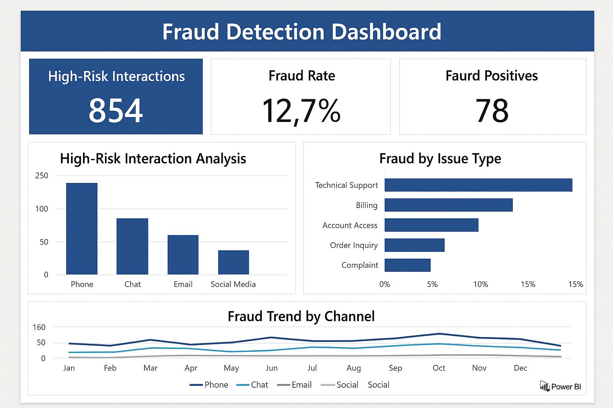

# 🛡️ Knoah Solutions – Risk Analytics Project

📌 **Project Title:** Fraud Detection in Customer Interactions  
🏢 **Company:** Knoah Solutions (Risk Analyst Role)  
🧠 **Focus:** Fraud Analytics | Machine Learning | Sentiment Analysis

---

## 📖 Project Overview

As a Risk Analyst at Knoah Solutions, I worked on identifying fraudulent behavior in customer interactions across multiple support channels. The goal was to proactively detect abuse or potential risks by analyzing response times, sentiment patterns, and issue types.

> ⚠️ *Note: This project uses simulated data for demonstration purposes due to confidentiality agreements with the company.*

---

## 🛠 Tools & Technologies

- **Languages:** Python, SQL
- **Python Libraries:** `pandas`, `scikit-learn`
- **SQL:** Used for high-risk data extraction queries
- **BI Tools:** Tableau / Power BI for fraud trend dashboards
- **Other:** Excel for reporting, Confluence for documentation

---

## 🧩 Key Tasks Performed

### 🔹 Data Collection & Cleaning
- Aggregated customer interactions from phone, chat, email, and social media channels  
- Cleaned and encoded issue types and categorical features  
- Engineered sentiment-based risk flags

### 🔹 Fraud Detection Modeling
- Trained a **Random Forest Classifier** using Python to identify suspicious behavior  
- Applied one-hot encoding and feature selection  
- Evaluated performance using precision, recall, and confusion matrix

### 🔹 SQL & Dashboard Reporting
- Created SQL queries to extract high-risk patterns (e.g., long response times, negative sentiment)  
- Built visualizations to monitor fraud trends by channel and issue type  
- Delivered findings through Tableau and Power BI dashboards

---

## ✅ Outcomes

- 🚩 Flagged suspicious cases using automated ML models  
- 📉 Reduced false positives through feature tuning and model evaluation  
- 📊 Enabled proactive monitoring of fraud trends across communication channels  
- 📈 Enhanced visibility for leadership through weekly analytics dashboards

---

## 📊 Dashboard Preview

To visualize trends and support decision-making, I created a dashboard (simulated in Power BI) that highlights:

- Fraud rate by issue type  
- Risk distribution by channel  
- Average sentiment score across flagged interactions

---

## 📂 Files Included

| File | Description |
|------|-------------|
| `knoah_risk_analytics_data.csv` | Simulated customer interaction dataset |
| `fraud_detection_knoah.py` | Python script for training fraud detection model |
| `knoah_sql_queries.sql` | Sample SQL queries to identify high-risk patterns |
| `project_summary_knoah.txt` | Executive project summary for portfolio |
| `images/fraud_detection_dashboard.png` | Simulated dashboard screenshot |

---

## 📄 License

This project is shared for academic and portfolio demonstration only.  
Licensed under the [MIT License](https://opensource.org/licenses/MIT).
